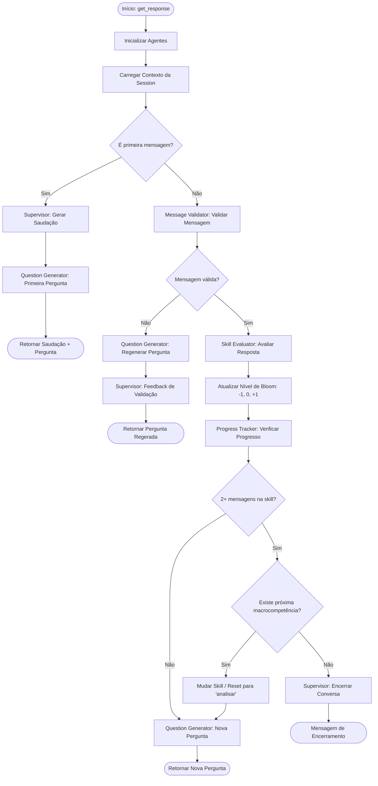

# Assessment API

API REST para orquestração de agentes de IA voltada à avaliação de habilidades (skills) por meio de um chatbot conversacional. A aplicação conduz entrevistas adaptativas baseadas na **Taxonomia de Bloom**, avaliando o nível de proficiência do usuário em diferentes macrocompetências.

## Visão Geral

O sistema utiliza um pipeline de múltiplos agentes de IA para:

1. **Gerar perguntas** adaptadas ao nível do candidato (Bloom)
2. **Validar respostas** para garantir que são pertinentes
3. **Avaliar proficiência** e ajustar dinamicamente o nível das perguntas
4. **Rastrear progresso** por macrocompetência e encerrar a sessão ao fim

O chatbot inicia com a macrocompetência e nível padrão `analisar`, sobe ou desce dentro dos 6 níveis de Bloom com base nas respostas, e avança para a próxima macrocompetência após 2 interações válidas.

### Fluxo dos Agentes



## Tecnologias

| Camada | Tecnologia |
|---|---|
| Linguagem | Python 3.12 |
| Framework API | FastAPI + Uvicorn |
| ORM / Banco | SQLAlchemy + PostgreSQL 16 |
| Agentes de IA | pydantic-ai + OpenAI (GPT-4o-mini) |
| Autenticação | Keycloak 23 (JWT / OAuth2 PKCE) |
| Observabilidade | Helicone |
| Gerenciador de pacotes | PDM |
| Containerização | Docker / Docker Compose |
| Frontend | React + TypeScript (Bun) |

## Agentes de IA

| Agente | Responsabilidade |
|---|---|
| **Supervisor** | Coordena saudação, feedback de mensagem inválida e encerramento |
| **Message Validator** | Valida se a resposta do usuário é pertinente à pergunta |
| **Skill Evaluator** | Avalia a resposta e classifica: -1 (diminuir), 0 (manter), +1 (subir) |
| **Question Generator** | Gera ou regenera perguntas baseadas no nível de Bloom e macrocompetência |

### Níveis de Bloom Suportados

`lembrar` → `compreender` → `aplicar` → `analisar` → `avaliar` → `criar`

## Estrutura do Projeto

```
assessment-api/
├── src/
│   ├── app/
│   │   ├── ai/
│   │   │   └── agents/
│   │   │       ├── services/         # Orquestrador principal
│   │   │       ├── prompts/          # Prompts de cada agente
│   │   │       ├── schemas/          # Schemas de entrada/saída
│   │   │       ├── helpers/          # Inicialização de estado
│   │   │       ├── supervisor.py
│   │   │       ├── message_validator.py
│   │   │       ├── skill_evaluator.py
│   │   │       └── question_generator.py
│   │   ├── auth/                     # Autenticação JWT / Keycloak
│   │   ├── database/                 # Configuração SQLAlchemy
│   │   ├── models/                   # Modelos ORM e schemas Pydantic
│   │   ├── repository/               # Camada de acesso a dados
│   │   ├── routers/                  # Endpoints FastAPI
│   │   ├── services/                 # Lógica de negócio
│   │   ├── observability/            # Integração Helicone
│   │   ├── config.py                 # Configurações via variáveis de ambiente
│   │   ├── logger.py
│   │   └── main.py                   # Ponto de entrada da aplicação
│   └── test/
│       └── http/                     # Arquivos .http para testes manuais
├── frontend/                         # Interface React (Bun)
├── docker-compose.yaml
├── Dockerfile
├── pyproject.toml
└── realm-export.json                 # Configuração do realm Keycloak
```

## Endpoints da API

Todos os endpoints requerem autenticação JWT via Keycloak (Bearer Token).

### Skills — `/api/v1/skills`

| Método | Rota | Descrição |
|---|---|---|
| `POST` | `/` | Criar nova skill |
| `GET` | `/` | Listar skills (filtro: `active_only`) |
| `GET` | `/{skill_id}` | Buscar skill por ID |
| `GET` | `/name/{name}` | Buscar skill por nome |
| `PUT` | `/{skill_id}` | Atualizar skill |
| `PATCH` | `/{skill_id}/activate` | Ativar skill |
| `PATCH` | `/{skill_id}/deactivate` | Desativar skill (soft delete) |
| `DELETE` | `/{skill_id}` | Deletar skill permanentemente |

### Sessions — `/api/v1/sessions`

| Método | Rota | Descrição |
|---|---|---|
| `POST` | `/` | Criar nova sessão |
| `GET` | `/` | Listar sessões do usuário |
| `GET` | `/{session_id}` | Buscar sessão por ID |
| `GET` | `/skill/{skill_id}` | Listar sessões por skill |
| `POST` | `/{session_id}/messages` | Enviar mensagem ao chatbot |
| `GET` | `/{session_id}/messages` | Listar mensagens da sessão |
| `GET` | `/{session_id}/messages/count` | Contar mensagens |
| `DELETE` | `/{session_id}` | Deletar sessão |

### Evaluations — `/api/v1/evaluations`

| Método | Rota | Descrição |
|---|---|---|
| `GET` | `` | Listar todas as avaliações |
| `GET` | `/{evaluation_id}` | Buscar avaliação por ID |
| `GET` | `/skill/{skill_id}` | Listar avaliações por skill |
| `GET` | `/session/{session_id}` | Buscar avaliação por sessão |
| `POST` | `/session/{session_id}` | Gerar avaliação a partir de uma sessão |

### Outros

| Método | Rota | Descrição |
|---|---|---|
| `GET` | `/` | Health check |
| `GET` | `/docs` | Swagger UI (com autenticação Keycloak) |
| `GET` | `/redoc` | ReDoc |
| `GET` | `/chat` | Interface do chatbot (frontend) |

## Configuração

Crie um arquivo `.env` na raiz do projeto com base nas variáveis abaixo:

```env
# Aplicação
APP_MODE=development          # development | production
APP_HOST=0.0.0.0
APP_PORT=8000

# Banco de dados
POSTGRES_HOST=localhost
POSTGRES_PORT=5432
POSTGRES_USER=postgres
POSTGRES_PASSWORD=sua_senha
POSTGRES_DB=assessment_db

# Keycloak
KEYCLOAK_SERVER_URL=localhost:8080
KEYCLOAK_ADMIN=admin
KEYCLOAK_ADMIN_PASSWORD=admin
KEYCLOAK_DB_NAME=keycloak
KEYCLOAK_PORT=8080

# JWT
JWKS_URI=realms/assessment/protocol/openid-connect/certs
ISSUER=realms/assessment
JWT_ALGORITHM=RS256
JWT_AUDIENCE=chatbot-frontend
JWT_SCOPES=openid

# OpenAI
OPENAI_API_KEY=sk-...

# Helicone (opcional)
HELICONE_ENABLED=true
HELICONE_API_KEY=sk-helicone-...
HELICONE_BASE_URL=https://oai.helicone.ai/v1
```

## Executando com Docker Compose

### Perfil completo (API + PostgreSQL + Keycloak)

```bash
docker compose --profile default up -d
```

### Apenas a API (banco e Keycloak externos)

```bash
docker compose --profile no-db up -d
```

### Parar os serviços

```bash
docker compose down
```

## Executando localmente (sem Docker)

### Pré-requisitos

- Python 3.12
- [PDM](https://pdm-project.org/)
- PostgreSQL em execução

### Instalação

```bash
# Instalar dependências
pdm install

# Ativar ambiente virtual
eval $(pdm venv activate)

# Executar a aplicação
cd src
python -m uvicorn app.main:app --host 0.0.0.0 --port 8000 --reload
```

## Modelo de Dados

### Skill

Representa uma habilidade a ser avaliada, contendo:
- `name`: Nome único da skill
- `description`: Descrição
- `questions`: Rubrics com perguntas por macrocompetência e nível de Bloom (JSONB)
- `agents_config`: Configuração dos modelos de IA por agente (JSONB)
- `active`: Status (soft delete)

### Session

Representa uma sessão de avaliação de um usuário para uma skill:
- `skill_id`: Referência à skill
- `user_id`: ID do usuário autenticado
- `messages`: Histórico de mensagens com params dos agentes (JSONB)

### Evaluation

Resultado consolidado de uma sessão concluída, vinculado à sessão e à skill.

## Observabilidade

A integração com o **Helicone** permite rastrear chamadas aos modelos de IA por sessão e agente. Os headers `Helicone-Session-Id`, `Helicone-User-Id` e `Helicone-Property-Agent-Type` são enviados automaticamente a cada chamada.

Métricas coletadas: latência, tokens (prompt/completion), custo estimado e tipo de agente.

Consulte o guia completo em `src/app/observability/HELICONE_GUIDE.md`.

## Documentação Interativa

Com a aplicação rodando, acesse:

- **Swagger UI**: [http://localhost:8000/docs](http://localhost:8000/docs)
- **ReDoc**: [http://localhost:8000/redoc](http://localhost:8000/redoc)
- **Chatbot**: [http://localhost:8000/chat](http://localhost:8000/chat)

## Licença

MIT — consulte o arquivo `pyproject.toml` para detalhes.
