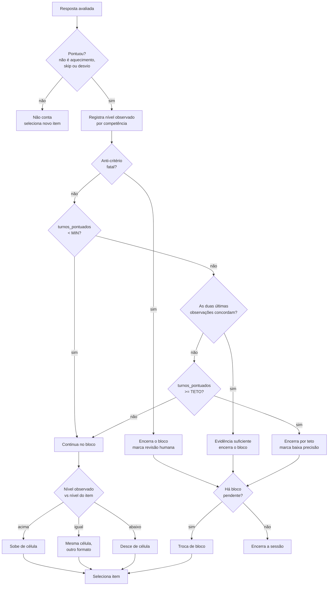
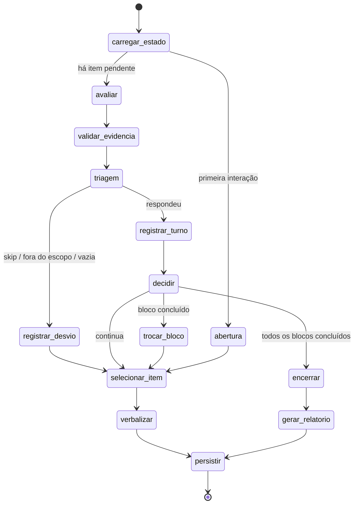
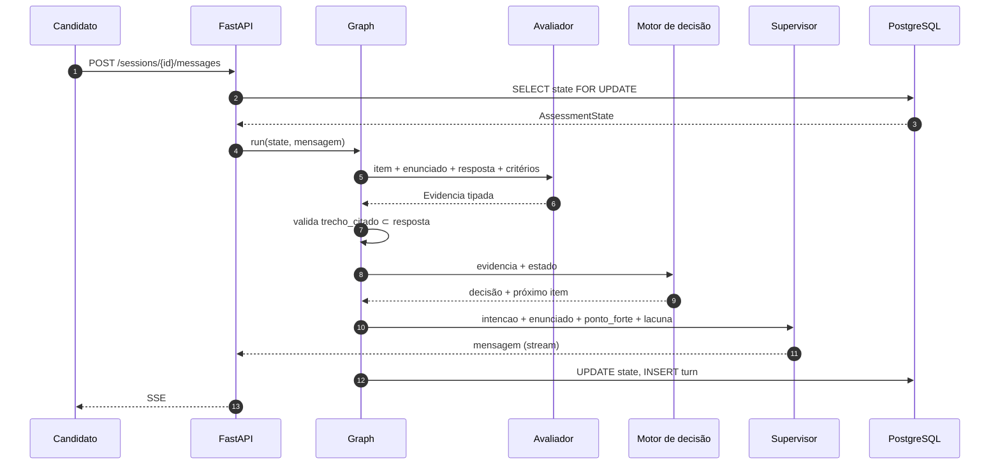
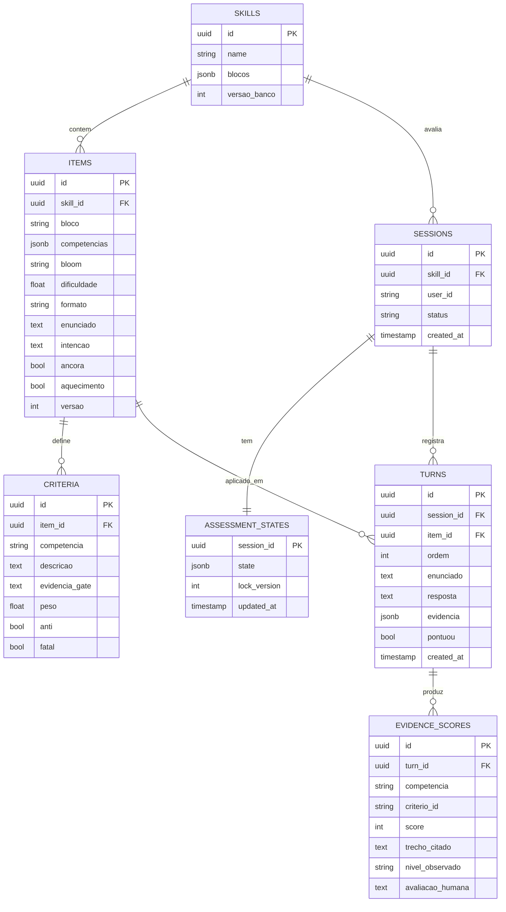

# Koru v2 — Especificação técnica

Reconstrução do motor de assessment. Escrita a partir da leitura do repositório atual (`PedrelliMath/a`).
Alvo: agente de codificação (Claude Code). Stack: Python 3.12+, Pydantic AI v2, Pydantic Graph, FastAPI, PostgreSQL, Keycloak.

Substitui integralmente a versão anterior deste documento.

---

## 0. Como usar este documento

Instale a skill oficial do Pydantic AI antes de escrever qualquer linha:
https://pydantic.dev/docs/ai/overview/coding-agent-skills/

A API do Pydantic AI mudou de forma significativa na v2. O código atual usa a API antiga. **Não escreva de memória.** Consulte:

- `GraphBuilder`, `g.step`, `g.node`, `g.edge_from().to()` → https://pydantic.dev/docs/ai/graph/builder/
- `BaseNode`, `GraphRunContext`, `End`, estado → https://pydantic.dev/docs/ai/graph/graph/
- `Agent`, `output_type`, `deps_type` → https://pydantic.dev/docs/ai/core-concepts/agent/
- `Dataset`, `Case`, evaluators → https://pydantic.dev/docs/ai/evals/getting-started/quick-start/
- Instrumentação OTel → https://pydantic.dev/docs/ai/integrations/logfire/

Confirme identificadores de modelo em https://pydantic.dev/docs/ai/models/overview/. Todo modelo vem de config.

**Leia a seção 15 antes de começar o v2.** Há correções no sistema atual que não devem esperar por esta reconstrução.

---

## 1. O que existe hoje, de fato

Levantamento do repositório, não suposição.

| Componente | Situação real |
|---|---|
| Orquestrador | `ai/agents/services/agent_orquestrator.py`, fluxo linear, 4 chamadas de LLM sequenciais por turno |
| Avaliador | modelo fine-tuned `ft:gpt-4.1-mini-2025-04-14:...:bloom-evaluator`, cliente OpenAI direto, fora do Pydantic AI |
| Rubricas | **não existem.** `skill.questions.rubrics` é `macro → nível → lista de perguntas`. Sem critério, sem GATE, sem escala |
| Macrocompetências | 4 chaves contendo **10 competências** separadas por vírgula, desmembradas em runtime por `parse_skill_group` |
| Estado | reconstruído a cada turno varrendo `params` das mensagens em `sessions.messages` (JSONB) |
| Perguntas | geradas em runtime; o prompt manda **fundir** várias perguntas de referência em uma |
| Progressão | `count_messages >= 2` por macro; nível sobe/desce por voto de maioria sobre `compare_bloom_levels` |
| Observabilidade | Helicone + CSV/JSON em `artifacts/observability/`, com coluna `avaliacao_humana` vazia |
| Duração | `assessment_properties.duration_minutes`, default 30 |
| Dead code | `ai/agents/helpers/state_initializer.py` importa módulos inexistentes; `_generate_supervisor_response` está duplicado |

### 1.1 O que já está certo e deve ser preservado

- **A separação parcial LLM/código.** O fine-tune devolve nível de Bloom atingido por habilidade; `compare_bloom_levels` e a agregação são código. Isso é a semente do princípio P1.
- **O tom do supervisor.** O `end_prompt` já proíbe validação emocional, marcadores colaborativos e reconhecimento afetivo. Postura avaliativa neutra está resolvida. Não mexer.
- **A avaliação por habilidade individual.** O avaliador já produz `skill_analysis` com nível por competência. O dado existe.
- **O embrião do golden set.** A coluna `avaliacao_humana` já está no CSV.

### 1.2 Os cinco problemas que esta spec resolve

**Pr1. Não existe rubrica.** Sem critério explícito, "boa evidência" é intuição individual, a regra de parada é arbitrária e não há defesa possível de um resultado contestado.

**Pr2. Informação é destruída todo turno.** O avaliador produz nível por habilidade; a votação por maioria colapsa em um `int` de -1 a 1. Os níveis por habilidade sobrevivem só em CSV local, nunca no banco.

**Pr3. O avaliador não vê a pergunta.** O payload é `{"habilidades_macro": [...]}` mais o texto da resposta. Sem contexto da pergunta, resposta fora do tópico pontua alto e foi preciso um `message_validator` separado para compensar.

**Pr4. Candidatos não são comparáveis.** Perguntas geradas em runtime com `temperature=0.3` significam estímulos diferentes para pessoas na mesma posição. Sem parâmetro de dificuldade, percursos diferentes não se equiparam.

**Pr5. Viés de registro verbal.** Classificar Bloom a partir do texto puro confunde complexidade cognitiva com sofisticação de escrita. Penaliza quem escreve direto, quem tem menos escolaridade formal e registros regionais distantes do padrão culto.

---

## 2. Princípios

Requisitos de arquitetura. PR que viole qualquer um deve ser rejeitado.

**P1. O LLM observa, o código decide.** Nenhum agente retorna nível final, progressão ou decisão de encerramento. Agentes retornam evidência estruturada. A progressão é função pura da evidência acumulada.

**P2. Toda afirmação avaliativa cita a fonte.** Todo score carrega um trecho literal da resposta. Trecho que não existe no texto original invalida o score, verificado em código.

**P3. O estado é explícito e persistido.** `AssessmentState` é a única fonte de verdade. Proibido derivar estado de mensagens.

**P4. A rubrica nunca chega ao gerador de perguntas.** O candidato não pode receber o instrumento de medição parafraseado.

**P5. Reprocessamento sem LLM.** Dado o histórico de evidências, o resultado deve ser recomputável em código puro. É requisito de arquitetura e de conformidade.

**P6. Mesmo estímulo na mesma posição.** Dois candidatos na mesma célula recebem o mesmo item. Variação de forma acontece entre células, nunca entre candidatos comparáveis.

**P7. Nada é medido sem ser medível.** Toda propriedade que a spec afirma (a escada de Bloom é ordenada, o avaliador concorda com humanos, o item não tem viés) tem um script que verifica. Sem o script, a afirmação não vale.

**P8. Falha explícita.** Sem `except Exception` genérico devolvendo mensagem cordial. Erros propagam, são instrumentados e viram estado persistido.

---

## 3. Decisões pendentes

Estas bloqueiam a Fase 2. Não implemente com valor default sem confirmação do time.

**D1. Granularidade da competência.** Recomendação: manter os pacotes atuais como **blocos de navegação**, mas persistir theta por **competência individual**. O dado já é produzido e descartado; passa a ser guardado. O relatório sai por competência, com incerteza declarada, e a sessão continua curta. Alternativas: manter agregado (rápido, relatório não pode afirmar nada individual) ou desmembrar em 10 macros (correto, exige 60 células de banco e sessão longa demais).

**D2. Orçamento.** Recomendação: trocar `duration_minutes` por número de itens. Limite de tempo favorece quem digita rápido, o que é variância irrelevante ao construto. Manter tempo apenas como timeout operacional generoso.

**D3. Onde fica o corte de evidência suficiente.** Não decidir por opinião. Rodar o exercício da seção 12.1 primeiro.

---

## 4. Modelo de domínio

### 4.1 Item bank

Conteúdo curado offline, versionado. **Nunca gerado em runtime.**

```python
from enum import StrEnum
from pydantic import BaseModel, Field

class BloomLevel(StrEnum):
    LEMBRAR = "lembrar"; COMPREENDER = "compreender"; APLICAR = "aplicar"
    ANALISAR = "analisar"; AVALIAR = "avaliar"; CRIAR = "criar"

BLOOM_ORDER: list[BloomLevel] = [
    BloomLevel.LEMBRAR, BloomLevel.COMPREENDER, BloomLevel.APLICAR,
    BloomLevel.ANALISAR, BloomLevel.AVALIAR, BloomLevel.CRIAR,
]

class ItemFormat(StrEnum):
    CENARIO = "cenario"      # situação concreta, pede decisão
    CRITICA = "critica"      # solução ruim apresentada, pede análise
    TRADEOFF = "tradeoff"    # duas opções, pede condição de escolha
    EXTENSAO = "extensao"    # aprofunda a resposta anterior
    DIRETA = "direta"        # pergunta conceitual direta

class Criterio(BaseModel):
    """Da rubrica. NUNCA sai do avaliador."""
    id: str
    competencia: str                 # competência individual, não o pacote
    descricao: str
    evidencia_gate: str = Field(description="O que precisa aparecer para o critério ser atendido")
    peso: float = 1.0

class AntiCriterio(BaseModel):
    id: str
    descricao: str
    fatal: bool

class Item(BaseModel):
    id: str
    bloco: str                       # o pacote de navegação (macro atual)
    competencias: list[str]          # competências individuais que este item sonda
    bloom: BloomLevel
    dificuldade: float | None = None # logit; None até ser calibrado
    formato: ItemFormat
    enunciado: str = Field(description="Texto fixo apresentado. Mesmo para todos os candidatos.")
    intencao: str = Field(description="O que o item quer que a pessoa demonstre. Vai para o supervisor.")
    criterios: list[Criterio]
    anti_criterios: list[AntiCriterio] = []
    ancora: bool = False             # se True, todo candidato vê este item
    aquecimento: bool = False        # se True, não pontua
    versao: int = 1
```

Regras do banco, validadas por `bank/validate.py`:

- Mínimo **3 itens por célula** (bloco × nível de Bloom). O banco atual tem células com 1 item; isso quebra skip e reformulação.
- Formatos variados na mesma célula. Nunca 3 itens `DIRETA` juntos.
- **3 a 4 itens marcados `ancora`** no total, distribuídos entre blocos.
- **1 item `aquecimento`** por sessão, sempre o primeiro, nunca pontuado.
- Mudar `enunciado` ou `criterios` incrementa `versao` e invalida a calibração daquele item.

### 4.2 Evidência

Saída única do avaliador. Observação, jamais decisão.

```python
from typing import Literal

class EvidenciaCriterio(BaseModel):
    criterio_id: str
    competencia: str
    score: Literal[0, 1, 2, 3]
    trecho_citado: str | None = Field(
        description="Cópia literal de trecho da resposta. None apenas quando score == 0 por ausência."
    )
    justificativa: str = Field(max_length=300)

class AntiCriterioDetectado(BaseModel):
    anti_criterio_id: str
    trecho_citado: str

class Evidencia(BaseModel):
    respondeu_a_pergunta: bool
    motivo_nao_resposta: Literal[
        "fora_do_escopo", "vazia", "skip_solicitado", "pedido_de_reformulacao"
    ] | None = None
    criterios: list[EvidenciaCriterio] = []
    anti_criterios: list[AntiCriterioDetectado] = []
    gate_por_competencia: dict[str, bool] = {}
    confianca: Literal["alta", "media", "baixa"] = "media"
    ponto_forte: str | None = Field(default=None, description="Trecho que o supervisor pode referenciar")
    lacuna: str | None = Field(default=None, description="O que faltou, para ancorar a próxima pergunta")
```

Não existe aqui: `classificacao`, `adequacao_macro`, `proximo_nivel`, `deve_encerrar`.

### 4.3 Estado

```python
from datetime import datetime
from uuid import UUID

class TurnoRegistro(BaseModel):
    """Uma resposta avaliada. Imutável. Log de auditoria e base do reprocessamento."""
    turno: int
    item_id: str
    item_versao: int
    bloco: str
    bloom: BloomLevel
    enunciado_apresentado: str
    mensagem_do_supervisor: str
    resposta_do_candidato: str
    evidencia: Evidencia
    nivel_observado: dict[str, BloomLevel]   # por competência
    pontuou: bool                            # False para aquecimento e desvios
    timestamp: datetime

class EstadoCompetencia(BaseModel):
    """Estimativa por competência individual. Ver decisão D1."""
    competencia: str
    observacoes: list[BloomLevel] = []        # níveis observados, em ordem
    nivel_estimado: BloomLevel | None = None
    concordante: bool = False                 # duas últimas observações batem
    theta: float | None = None                # preenchido só na fase de calibração
    erro_padrao: float | None = None

class EstadoBloco(BaseModel):
    bloco: str
    bloom_corrente: BloomLevel = BloomLevel.APLICAR
    itens_aplicados: list[str] = []
    turnos_pontuados: int = 0
    concluido: bool = False
    motivo_conclusao: Literal[
        "evidencia_concordante", "teto_de_itens", "anti_criterio_fatal", "banco_esgotado"
    ] | None = None

class AssessmentState(BaseModel):
    sessao_id: UUID
    skill_id: UUID
    candidato_id: str
    bloco_corrente: str
    blocos: dict[str, EstadoBloco]
    competencias: dict[str, EstadoCompetencia]
    historico: list[TurnoRegistro] = []
    item_pendente: Item | None = None
    ancoras_aplicadas: list[str] = []
    revisao_humana: bool = False
    encerrada: bool = False
    criada_em: datetime
    atualizada_em: datetime
```

`AssessmentState` é serializado inteiro em JSONB. É a única coisa necessária para retomar uma sessão.

---

## 5. Regra de parada

O time descreveu a intenção assim: encontrar boa evidência de que o candidato sabe algo e passar para a próxima macro. Isso não é subjetivo, está indefinido. A definição operacional abaixo captura exatamente essa intenção sem precisar de item calibrado.

### 5.1 Regra v2.0 (implementável desde já)

Baseada em **concordância entre observações independentes**, usando o dado que o avaliador já produz.



Parâmetros, em config:

| Parâmetro | Default | Nota |
|---|---|---|
| `MIN_TURNOS_BLOCO` | 2 | nunca conclui antes disso |
| `TETO_TURNOS_BLOCO` | 4 | teto duro |
| `CONCORDANCIA_EXIGE_N` | 2 | observações consecutivas iguais |
| `CONFIANCA_BAIXA_NAO_CONTA` | true | evidência de baixa confiança não conta como observação |
| `TOLERA_ADJACENTE` | false | se true, níveis vizinhos contam como concordantes |

A lógica em uma frase: **para quando duas observações independentes caem no mesmo lugar, insiste quando divergem.** Uma resposta em "aplicar" e outra em "criar" significa que você não sabe onde a pessoa está, então faz a terceira, que desempata.

`TOLERA_ADJACENTE` merece um teste A/B contra os dados anotados: com 6 níveis, concordância exata pode ser exigente demais e estourar o teto com frequência.

### 5.2 Regra v2.1 (após calibração)

Quando existir `dificuldade` calibrada para os itens, trocar concordância por **erro padrão abaixo de um limiar**, com modelo 1PL. A interface do motor de decisão não muda; só a implementação interna de `progression.py`. Projete a v2.0 com essa troca em mente: `decidir_proximo_passo(estado, evidencia) -> Decisao` é a fronteira estável.

Não implemente IRT antes de ter ~200 sessões reais. Sem dados, o modelo é enfeite.

---

## 6. Justiça e comparabilidade

Este sistema toma decisões sobre pessoas. As medidas abaixo não são refinamento, são requisito.

### 6.1 Medidas estruturais

**Itens fixos.** Todo candidato na mesma célula recebe o mesmo `enunciado`. Isso sozinho resolve mais que qualquer ajuste posterior: não há correção estatística que equipare estímulos que nunca foram iguais.

**Itens âncora.** 3 a 4 itens que todo candidato vê, independentemente do caminho adaptativo. São eles que permitem colocar percursos diferentes na mesma escala e são o insumo da calibração de dificuldade.

**Item de aquecimento.** O primeiro item da sessão não pontua. Elimina, para todos igualmente, a penalidade da primeira resposta, quando a pessoa ainda está calibrando o formato esperado. Hoje isso penaliza sistematicamente o bloco que aparece primeiro na lista.

**Ponto de partida.** Nunca hardcode o primeiro bloco. Randomize a ordem dos blocos por sessão, com seed determinística derivada do `sessao_id` para ser reproduzível.

**Orçamento em itens, não em minutos.** Ver decisão D2.

### 6.2 Contra o viés de registro verbal

O risco central: modelos de linguagem confundem complexidade cognitiva com sofisticação verbal. Quem escreve em registro formal, com vocabulário acadêmico e períodos longos, é lido como operando em nível de Bloom mais alto ao descrever a mesma operação mental. Isso é variância irrelevante ao construto e penaliza escolaridade formal, concisão e registro regional.

**Mitigação 1: score ancorado em trecho citado.** Obrigar o avaliador a apontar o pedaço da resposta que sustenta cada score empurra o julgamento para o conteúdo e para longe do estilo.

**Mitigação 2: critério explícito.** Uma rubrica com `evidencia_gate` concreto ("cita uma situação real com resultado observável") é muito menos sensível a registro que "demonstra capacidade de análise".

**Mitigação 3: instrução explícita ao avaliador.** Registro, vocabulário, extensão e correção gramatical não são critérios. Uma resposta curta e direta pode atingir qualquer nível.

**Mitigação 4: auditar o dado de treino do fine-tune.** Vale saber de quem eram as respostas que ensinaram o `bloom-evaluator` o que é "analisar". Se o conjunto era homogêneo em escolaridade ou área, o viés está nos pesos e nenhum prompt corrige.

### 6.3 Como verificar (princípio P7)

Scripts obrigatórios em `scripts/`:

| Script | O que mede | Critério |
|---|---|---|
| `check_verbosity_bias.py` | correlação entre score e número de tokens da resposta | acima de 0.4 é alerta vermelho |
| `check_dif.py` | funcionamento diferencial de item por grupo, controlando por nível estimado | item com DIF significativo sai do banco |
| `check_agreement_stratified.py` | concordância com humano, estratificada por tamanho e registro da resposta | divergência entre estratos indica viés |
| `validate_bloom_ladder.py` | taxa média de score por nível de Bloom, por bloco | deve ser monotônica decrescente de `lembrar` a `criar` |
| `calibrate_difficulty.py` | reestima `Item.dificuldade` a partir de dados reais | roda após ~200 sessões |

`check_verbosity_bias.py` roda com os dados que vocês já têm. É o primeiro a ser escrito.

### 6.4 Conformidade

A LGPD dá ao titular direito de solicitar revisão de decisão tomada exclusivamente por tratamento automatizado que afete seus interesses. Na prática isso exige explicar um resultado individual item por item, com o texto que sustentou cada julgamento, e ter caminho de revisão humana funcional.

O sistema atual não consegue: o que sobra de uma sessão é um inteiro por turno e um CSV em `artifacts/`. Os requisitos P2, P5 e o endpoint de auditoria da seção 9 cobrem isso. Validar o enquadramento com o jurídico da Koru.

---

## 7. O grafo

Um `graph.run()` por mensagem do candidato.



Apenas `avaliar` e `verbalizar` chamam LLM. Todo o resto é código puro.

Depois de construir o grafo, gere o mermaid a partir dele e trate como teste:

```python
print(assessment_graph)   # pydantic_graph gera o stateDiagram-v2 a partir dos tipos de retorno dos nós
```

Commite o output em `docs/graph.md` e faça o CI falhar se divergir. O diagrama deixa de ser documentação e vira verificação.

### 7.1 Sequência de um turno



Persistência acontece em paralelo ao streaming. O candidato começa a ler antes do commit terminar.

---

## 8. Os dois agentes

### 8.1 Avaliador

Uma chamada por turno. `temperature=0`. Absorve o antigo `message_validator`.

Migrar o `AgentSkillEvaluator` do cliente OpenAI direto para `Agent` do Pydantic AI, com `output_type=Evidencia`. O modelo fine-tuned continua utilizável, configurado como modelo do agente. Se o fine-tune não conseguir produzir o schema completo de `Evidencia`, rode-o como primeira passada (nível observado) e um modelo forte como segunda (evidência citada), mas **prefira uma chamada só**.

Contexto injetado, e isto corrige o problema Pr3:

```python
@dataclass
class ContextoAvaliacao:
    enunciado: str              # o que foi perguntado. Hoje isso NÃO chega ao avaliador.
    resposta: str
    competencias: list[str]
    criterios: list[Criterio]
    anti_criterios: list[AntiCriterio]
    bloom_do_item: BloomLevel
```

Sem histórico longo. O avaliador julga um par pergunta/resposta, não uma conversa.

Instruções, em resumo:

- Você observa, não decide. Não sugira nível final, progressão nem próximo passo.
- Para cada critério, atribua 0 a 3 e cite um trecho literal da resposta. Sem trecho que sustente, o score é 0 e `trecho_citado` é `None`.
- O gate de uma competência é atendido apenas se a evidência descrita em `evidencia_gate` aparece explicitamente.
- Se a resposta não responde ao `enunciado`, marque `respondeu_a_pergunta=false` e o motivo. Não pontue.
- **Registro, vocabulário, extensão e correção gramatical não são critérios.** Uma resposta curta e direta pode atingir qualquer nível. Uma resposta longa e elaborada pode não atingir nenhum.
- `confianca` é `baixa` quando a resposta é ambígua, curta demais para julgar, ou quando você teve que inferir.

Validação em código após a chamada:

```python
def validar_evidencia(ev: Evidencia, resposta: str) -> Evidencia:
    normalizada = normalizar(resposta)
    for ec in ev.criterios:
        if ec.trecho_citado and normalizar(ec.trecho_citado) not in normalizada:
            logger.warning("trecho_alucinado", criterio=ec.criterio_id)
            ec.score = 0
            ec.trecho_citado = None
            ev.confianca = "baixa"
    return ev
```

Taxa de trecho alucinado é métrica de saúde. Acima de 5% indica prompt ou modelo inadequado.

### 8.2 Supervisor

Modelo barato, streaming. É quem fala com o candidato.

**Preserve o `end_prompt` atual.** A postura avaliativa neutra já está bem calibrada e não deve ser reescrita. As mudanças são de contexto, não de tom.

```python
@dataclass
class ContextoSupervisor:
    enunciado: str                   # texto fixo do item
    intencao: str
    formato: ItemFormat
    ponto_forte_anterior: str | None # NOVO: hoje a evidência não chega ao supervisor
    lacuna_anterior: str | None      # NOVO
    resposta_anterior: str | None    # só para formato EXTENSAO
    ultimas_trocas: list[dict]       # 6 mensagens, não 4
    trocou_de_bloco: bool
```

Três mudanças em relação ao atual:

**O enunciado é fixo e o supervisor apresenta, não reescreve.** Isso é exigência do princípio P6. O supervisor pode adicionar meia frase de ligação; não pode alterar o estímulo. Contradiz o `question_generator` atual, que é removido.

**A evidência chega ao supervisor.** `ponto_forte_anterior` permite reconhecimento factual e curto do que a pessoa cobriu, sem elogio, o que resolve o principal sinal de artificialidade. `lacuna_anterior` ancora a transição.

**Nada de frase de transição sorteada.** `helpers/transition_phrases.py` é removido. Com `ponto_forte_anterior` disponível, frase pronta é desnecessária, e lista finita é detectada rápido pelo usuário.

Instruções adicionais ao que já existe:

- Apresente o enunciado como está. Você pode acrescentar no máximo meia frase de ligação antes dele. Não reescreva, não resuma, não combine perguntas.
- Reconhecimento é factual e curto: nomeie o que a pessoa cobriu, meia frase, e siga. Nunca resuma a resposta anterior.
- Nunca mencione níveis de Bloom, competências, critérios ou pontuação.

### 8.3 O que é removido

- `question_generator.py` e seus prompts. A fusão de perguntas de referência em uma é a causa direta do efeito formulário e viola P6.
- `message_validator.py`. Absorvido pelo avaliador via `respondeu_a_pergunta`.
- `helpers/transition_phrases.py`.
- `helpers/state_initializer.py`. Já está quebrado, importa módulos inexistentes.

De 4 chamadas de LLM por turno para 2.

---

## 9. Persistência



`EVIDENCE_SCORES` é a correção do problema Pr2. Uma linha por critério por turno, com o nível observado por competência. É o que hoje vira string `"skill:0, skill:1"` e some. A coluna `avaliacao_humana` migra do CSV para cá, onde é consultável.

Notas:

- `assessment_states.state` guarda o `AssessmentState` completo em JSONB. `lock_version` para lock otimista.
- `turns` e `evidence_scores` são append-only. Nunca update, nunca delete.
- `SELECT ... FOR UPDATE` na sessão no início do turno, contra corrida quando o candidato envia duas mensagens rápidas.
- A tabela `evaluations.iterations` atual mapeia conceitualmente para `turns`, mas o conteúdo não é migrável. Ver seção 14.

---

## 10. API

```
POST   /sessions                       cria sessão, retorna abertura + item de aquecimento
POST   /sessions/{id}/messages         envia resposta, SSE com a próxima mensagem
GET    /sessions/{id}                  progresso público (sem nível, sem score)
GET    /sessions/{id}/report           relatório final, só quando encerrada
POST   /sessions/{id}/reprocess        recomputa a partir de turns, sem LLM
GET    /admin/sessions/{id}/audit      turns + evidence_scores completos (autenticado)
POST   /admin/turns/{id}/human-review  grava avaliacao_humana
```

`/reprocess` é o teste vivo do princípio P5. Se não existir ou não funcionar, a arquitetura falhou.

**Nunca exponha ao candidato durante a sessão:** nível estimado, score por critério, nível de Bloom corrente, competências sendo medidas. Isso muda o comportamento de resposta e contamina a medição. O progresso mostrado é "pergunta 5 de aproximadamente 12".

---

## 11. Observabilidade

Instrumentação OTel nativa do Pydantic AI. O Helicone atual pode continuar como proxy, mas o tracing passa a ser OTel.

| Span | Atributos |
|---|---|
| `turno` | `sessao_id`, `bloco`, `bloom`, `item_id`, `pontuou` |
| `avaliar` | `modelo`, `tokens`, `confianca`, `trechos_alucinados`, `respondeu_a_pergunta` |
| `decidir` | `acao`, `turnos_pontuados`, `concordancia`, `motivo_conclusao` |
| `verbalizar` | `modelo`, `formato_item`, `tempo_ate_primeiro_token` |

Alertas: `confianca=baixa` acima de 20%, trecho alucinado acima de 5%, encerramento por `teto_de_itens` acima de 30% (indica que a regra de concordância está exigente demais), p95 do avaliador acima de 6s.

---

## 12. Golden set e avaliação

### 12.1 Exercício de ancoragem (fazer antes de codar)

Resolve a decisão D3 e produz o golden set inicial. Custa uma tarde.

1. Selecione 20 transcrições reais de sessões já rodadas.
2. Peça a três pessoas do time que marquem, em cada uma, **em que ponto teriam mudado de assunto**. Sem discutir entre si.
3. Compare as marcações.

Se concordam na maioria dos casos, olhe o que as respostas marcadas têm em comum. Provavelmente exemplo específico, resultado mensurável, ou decisão justificada. Isso vira o texto dos `evidencia_gate`.

Se discordam muito, o problema não é o algoritmo. Nenhuma regra de parada satisfaz um time que não concorda sobre o que é evidência suficiente, e a conversa que precisa acontecer é sobre a rubrica.

As transcrições marcadas já vêm com julgamento humano anexado. É o começo do golden set.

### 12.2 Suite de evals

`pydantic_evals`, em `evals/`. Métricas obrigatórias no CI:

- **Concordância adjacente** com anotação humana, por critério. Meta acima de 0.85.
- **Kappa quadrático ponderado** por célula. Abaixo de 0.6 numa célula significa rubrica mal escrita naquela célula.
- **Taxa de trecho alucinado.** Meta abaixo de 0.05.
- **Falso gate**: gate marcado como atendido quando o humano marcou não atendido. Mais grave que erro de score.
- **Concordância estratificada** por tamanho de resposta. Ver 6.3.

Mínimo 100 casos anotados antes de considerar o avaliador confiável. Bloquear merge em qualquer regressão.

---

## 13. Estrutura de diretórios

```
src/app/
  domain/
    bloom.py            BloomLevel, BLOOM_ORDER
    items.py            Item, Criterio, AntiCriterio, ItemFormat
    evidence.py         Evidencia e schemas
    state.py            AssessmentState, EstadoBloco, EstadoCompetencia, TurnoRegistro
  engine/
    progression.py      decidir_proximo_passo  ← fronteira estável v2.0 / v2.1
    selection.py        selecionar_item
    agreement.py        regra de concordância
    theta.py            (fase 7) 1PL
    config.py           parâmetros
  agents/
    evaluator.py        Agent + validar_evidencia
    supervisor.py       Agent
    prompts/
  graph/
    nodes.py
    build.py
  bank/
    loader.py
    validate.py         3 itens/célula, formatos, âncoras, aquecimento
  persistence/
  api/
evals/
  golden/
  metrics.py
scripts/
  check_verbosity_bias.py
  check_dif.py
  check_agreement_stratified.py
  validate_bloom_ladder.py
  calibrate_difficulty.py
  reprocess_session.py
docs/
  graph.md              gerado por graph.render(), verificado no CI
tests/
```

---

## 14. Fases

Ordem obrigatória. Cada fase tem aceite verificável.

**Fase 0 — Exercício de ancoragem (§12.1).** Sem código. Aceite: `evidencia_gate` escrito para pelo menos um bloco, e decisão D3 tomada com base em dados.

**Fase 1 — Domínio e motor de decisão, sem LLM.** `domain/` e `engine/` completos. Aceite: `pytest` passa; simulação com respondente sintético não produz loop nem encerramento prematuro; a regra de concordância reproduz as marcações humanas da Fase 0 em pelo menos 70% das transcrições.

**Fase 2 — Item bank.** Autorar itens com critérios para um bloco piloto, mais âncoras e aquecimento. Aceite: `bank/validate.py` passa; 3 itens em toda célula do bloco piloto.

**Fase 3 — Avaliador e golden set.** Migrar para Pydantic AI, passar o enunciado, implementar `validar_evidencia`, anotar 100 casos. Aceite: concordância adjacente acima de 0.85, alucinação abaixo de 0.05, `check_verbosity_bias.py` abaixo de 0.4.

**Fase 4 — Grafo e persistência.** Grafo, repositórios, lock otimista, `evidence_scores`. Sem supervisor: a saída é o enunciado cru. Aceite: sessão completa ponta a ponta; `/reprocess` reproduz o resultado sem chamar LLM.

**Fase 5 — Supervisor e streaming.** Aceite: 10 sessões manuais sem repetição de estrutura perceptível; tempo até primeiro token abaixo de 1.5s.

**Fase 6 — Auditoria, relatório e revisão humana.** Endpoints de audit e human-review, spans, alertas.

**Fase 7 — Calibração.** Após ~200 sessões: `calibrate_difficulty.py`, `validate_bloom_ladder.py`, `check_dif.py`. Migrar `progression.py` para a regra v2.1.

---

## 15. Correções imediatas no sistema atual

Não esperam pelo v2. Ordenadas por retorno sobre esforço.

**C1. Persistir `skill_analysis` em vez do voto.** O avaliador já produz nível por habilidade individual; `adequacao_habilidades` colapsa em string e a maioria vira um `int`. Gravar o `skill_analysis` estruturado em `evaluations.iterations`. Uma tarde de trabalho, e recupera informação que hoje é destruída em toda sessão de todo candidato desde sempre.

**C2. Passar `question` ao avaliador.** Hoje `dados_classificacao` só leva `habilidades_macro`. Incluir o enunciado permite detectar resposta fora do tópico e provavelmente torna o `message_validator` redundante.

**C3. Rodar `check_verbosity_bias.py` nos dados existentes.** Correlação entre score e tamanho da resposta. Não exige nenhuma mudança no sistema e responde se o viés mais sério está presente.

**C4. Remover a duplicata de `_generate_supervisor_response`.** Há duas definições no orquestrador. Python usa a segunda; a primeira é um copy-paste quebrado do `_handle_skip` que referencia variáveis fora de escopo. O branch `flow_type="followup"` está morto.

**C5. Deletar `helpers/state_initializer.py`.** Importa `app.db.models` e `app.agents.schemas.agents.graph.state`, inexistentes. ImportError se alguém importar.

**C6. Preencher as células vazias do banco de perguntas.** "Autoconhecimento" tem 1 pergunta por nível. Skip e reformulação naquele bloco não têm de onde tirar item e forçam troca de nível indevida.

**C7. Randomizar a ordem dos blocos.** Hoje todo mundo começa em `available_skills[0]`. O primeiro bloco é sistematicamente penalizado pelo efeito de primeira resposta.

---

## 16. Anti-requisitos

- **Não** gere perguntas em runtime, nem como fallback. Célula sem item é erro de configuração e deve falhar alto.
- **Não** funda várias perguntas de referência em uma. Foi a causa do efeito formulário.
- **Não** dê ferramentas ao avaliador. Ele lê e classifica.
- **Não** passe o histórico completo ao avaliador. Ele julga um par pergunta/resposta.
- **Não** use um agente orquestrador que decide qual sub-agente chamar. O fluxo é fixo; roteador LLM só adiciona latência e não determinismo.
- **Não** persista mensagens como fonte de estado.
- **Não** exponha score, nível ou competência ao candidato durante a sessão.
- **Não** implemente IRT antes de ter dados para calibrar.
- **Não** reescreva o `end_prompt` do supervisor. O tom já está certo.

---

## 17. Migração a partir do v1

Sessões antigas **não são migráveis**. Não existe evidência estruturada nem critério, apenas um `classificacao` de -1 a 1 derivado de rubricas que eram listas de perguntas. Deixe-as em modo somente leitura, com resultado congelado e marcação explícita de que foram avaliadas pela metodologia v1. Não tente recomputar.

Aproveitável:

- As perguntas existentes viram `enunciado` de itens `DIRETA`, e cada célula precisa de pelo menos dois itens adicionais em outro formato.
- Os `bloom_levels` com descrição, `acima` e `abaixo` são reaproveitados integralmente.
- O `end_prompt` do supervisor.
- O `justification_system_prompt_template`, que já exige citação de trecho e proíbe tautologia. É o mais próximo de uma rubrica que existe no sistema e serve de base para escrever os `evidencia_gate`.
- O fine-tune `bloom-evaluator`, sujeito à auditoria descrita em 6.2.
- A metodologia conceitual (matriz de competências × Bloom, escala 0-3, anti-critérios fatais, gatilho de revisão humana). É a parte mais valiosa do v1 e ainda não está implementada em lugar nenhum.
